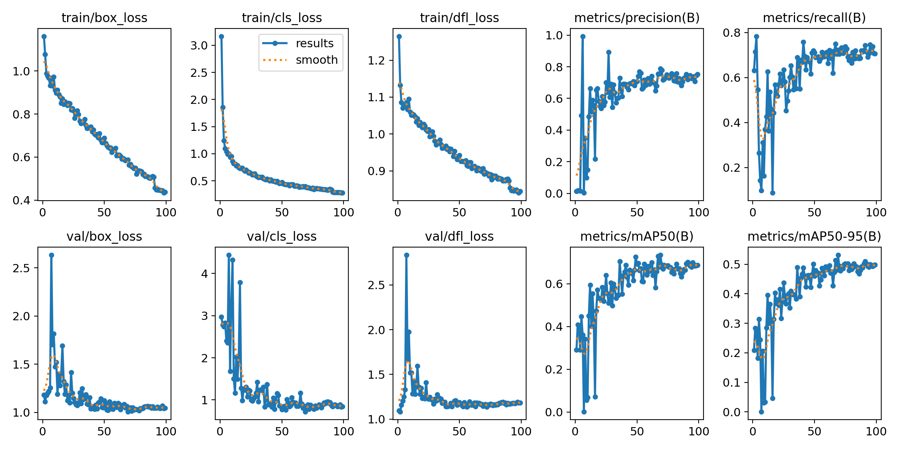
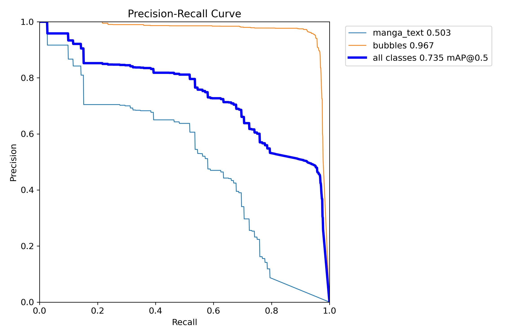
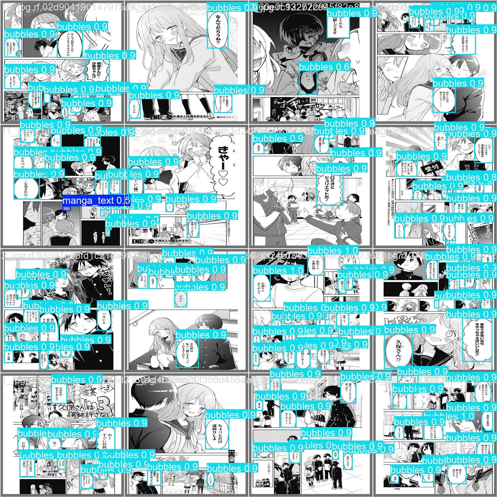

# Online Manga Reader and Translator


AI-powered manga and comic translation platform with two product surfaces:
1. A Next.js Web App for page-level translation and visual rendering.
2. A Browser Extension for in-context translation on reading websites.

This project is designed as a production-minded system that detects speech bubbles, extracts text, translates content in near real time, and overlays translated text while preserving the original reading flow and artwork.

## 1. Project Introduction and Purpose

This repository implements an end-to-end AI translation pipeline for manga and comics. The core objective is to provide seamless, low-latency translation of speech bubbles without breaking the reader experience.

### Purpose

- Detect speech bubbles from raw comic pages.
- Extract text reliably from noisy manga imagery.
- Translate text with high throughput and lower API cost.
- Render translated content back into bubbles while preserving composition and readability.

## 2. Tech Stack and Features

### Backend (Core Focus)

- FastAPI for API orchestration and service lifecycle management.
- Python async architecture with asyncio for concurrent pipeline stages.
- YOLOv11n (ONNX) for speech bubble detection.
- RapidOCR with ONNX Runtime for OCR extraction.
- OpenCV for pre-processing and inpainting.
- Supabase for authentication, credit accounting, and usage logging.
- SlowAPI-based rate limiting for API abuse control.

### Frontend (Brief)

- Next.js Web App for upload, processing, and review workflows.
- HTML5 Canvas rendering pipeline for polygon-aware translated overlays.
- Browser Extension (Manifest V3, Vite + TypeScript + React) for on-page translation UX - *In progress*.

### Core Features

- End-to-end page pipeline: Detect -> OCR -> Translate -> Render.
- Pay-per-page idempotency based on resource identity (24h free pass for repeat translation of same source).
- Concurrency-aware orchestration with async execution and CPU offloading.
- API rate limiting on translation and OCR pathways.
- Batch translation to minimize LLM round trips and reduce cost per page.

## 3. System Architecture and Workflow


### Workflow

1. Detect: YOLOv11n locates candidate speech bubbles and returns boxes plus bubble polygons.
2. Pre-process and OCR: OpenCV pre-processing (grayscale and image conditioning) prepares bubble crops, then RapidOCR extracts text concurrently per bubble.
3. Polygon Extraction: OpenCV's classical algorithms are utilized to extract precise polygonal contours of speech bubbles from the bounding boxes provided by YOLO. This approach is computationally efficient compared to building a separate segmentation model, leveraging adaptive thresholding, connected components analysis, and contour approximation to achieve accurate polygon extraction.
4. Translate: OCR text is grouped into a single batched LLM request (Gemini) to optimize token usage, latency, and throughput.
5. Render: Inpainting removes original text regions, then HTML5 Canvas renders translated text with polygon-aware layout and auto-scaling behavior.

## 4. System Optimizations

This system emphasizes practical inference efficiency and deployment reliability over heavyweight model stacks.

### Key Architectural Decisions

- Lightweight object detection over segmentation:
YOLOv11n is used for fast bubble localization, providing strong speed/quality trade-offs for real-time UX versus heavier semantic segmentation alternatives.

- ONNX-first inference runtime:
Both detection and OCR are executed through ONNX Runtime, removing hard dependencies on PyTorch/PaddlePaddle in production services. This reduces image size, simplifies deployment, and improves serverless cold-start behavior.

- Async parallelization for per-bubble workloads:
The page orchestrator runs per-bubble OCR and inpainting in parallel via asyncio.gather, while CPU-bound image operations are offloaded with asyncio.to_thread to keep the event loop responsive.

- Batched LLM translation:
Instead of sending image payloads repeatedly to an LLM, the backend first extracts text via OCR and then performs one batched translation call. This design cuts latency and API cost while preserving output consistency.

- Token and inference waste controls:
Low-confidence OCR outputs and noise-only text are filtered before translation, preventing unnecessary token usage and reducing false-positive translation overlays.

- Billing idempotency for user trust:
Repeated requests on the same source image within a 24-hour window are recognized and not billed again, ensuring fair credit accounting under retries and refreshes.

## 5. AI Model Training (YOLOv11n)

The detection model is trained on manga/comic speech bubble data, with iterative hyperparameter search and evaluation against validation metrics.

### Dataset and Training Process

- Dataset focus: speech bubble localization across manga-style page layouts.
- Training base: YOLO11n architecture with iterative tuning.
- Hyperparameter optimization: Random search was employed to identify the best hyperparameters for training the YOLO model, leveraging the Ultralytics library for efficient experimentation.
- Dataset configuration is under models/data/data.yaml.
- Exported production model is consumed as backend/models/best.onnx.

### Evaluation


- The training results show a consistent decrease in loss values over the epochs, indicating that the model is learning effectively. The validation loss also decreases, suggesting that the model generalizes well to unseen data.


- The precision-recall curve demonstrates high precision for the `bubbles` class, achieving a precision of `0.967`. The overall `mAP@0.5` score of `0.735` indicates good performance across all classes, with room for improvement in the `manga_text` class.


- The validation predictions image highlights the model's ability to accurately detect and classify speech bubbles and manga text. The bounding boxes and confidence scores suggest that the model performs well in identifying and localizing the target objects.

## 6. Installation and Local Setup

### Prerequisites

- Python 3.13+
- Node.js 20+
- npm
- Docker (optional, for containerized local run)

### 6.1 Train or Update the Detection Model (Optional)

To train or update the detection model, prepare the dataset configuration file located at:

```text
models/data/data.yaml
```

After training and exporting the model, place the ONNX file at:

```text
backend/models/best.onnx
```

### 6.2 Backend Setup (FastAPI)

```bash
cd backend
python -m venv .venv
```

Windows PowerShell:

```powershell
.venv\Scripts\Activate.ps1
```

Install dependencies:

```bash
pip install -r requirements.txt
```

Run the API:

```bash
uvicorn app.main:app --reload --host 0.0.0.0 --port 8080
```

### 6.3 Frontend Setup (Next.js Web App)

```bash
cd web-app
npm install
npm run dev
```

Default local URL: http://localhost:3000

### 6.4 Browser Extension Setup

```bash
cd extension
npm install
npm run build
```

Load extension build output in Chrome via chrome://extensions (Developer Mode -> Load unpacked -> extension/dist).

### 6.5 Environment Variables

Create backend/.env:

```env
GEMINI_API_KEY=your_gemini_key
SUPABASE_URL=your_supabase_url
SUPABASE_KEY=your_supabase_service_role_key
SUPABASE_ANON_KEY=your_supabase_anon_key
FRONTEND_URL=http://localhost:3000
```

Create web-app/.env.local:

```env
NEXT_PUBLIC_API_URL=http://localhost:8080
```

## 7. Deployment and CI/CD

### Production Topology

- Backend: Dockerized FastAPI service deployed to Google Cloud Run.
- Frontend: Next.js application deployed to Vercel.
- Artifact Management: Backend container images pushed to Google Artifact Registry.

### Backend Container Strategy

- Multi-stage Docker build in backend/Dockerfile.
- Builder stage prebuilds Python wheels for faster, reproducible installs.
- Runtime stage installs only required system packages and application artifacts.

### Automated Deployment Pipeline

GitHub Actions workflow builds and deploys backend services on pushes to main affecting backend paths:

1. Checkout source.
2. Authenticate to Google Cloud via service account credentials.
3. Pull ONNX model artifact from Google Cloud Storage.
4. Build and push image to Artifact Registry.
5. Deploy new revision to Cloud Run with runtime environment variables.

Referenced workflow:
- [deploy.yaml](.github/workflows/deploy-backend.yaml)

## 8. Future Roadmap

- Expand support for color comics and Webtoon-like non-white/gradient backgrounds.
- Improve handling of vertical text languages and native manga typography conventions.
- Evolve from bounding-box approximations to polygon-level semantic segmentation for precise text wrapping.
- Build advanced Canvas typography logic for complex dialogue layout and stylistic fidelity.

## Repository Structure (High-Level)

```text
backend/     FastAPI APIs, orchestration, detection, OCR, translation, billing logic
web-app/     Next.js UI and Canvas rendering layer
extension/   Browser extension for in-context translation
models/      Training assets, datasets, ONNX/PT weights, experiments
```

## License

This project is licensed under the terms defined in [LICENSE](LICENSE).
